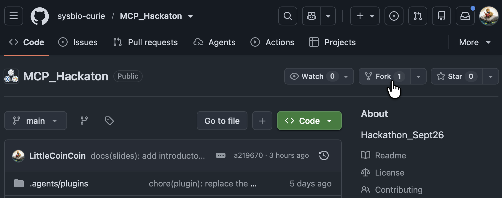

# Submitting your project

Your project joins this repository as a **git submodule** under `hackathon_projects/`, added via a
pull request from your own fork. This keeps your code and its history in your own repository: only
a pointer to a specific commit of it lives here.

Before you start, have three things ready. The rest of this page uses them as placeholders:

- **`<you>`**: your GitHub username
- **`<your-project>`**: the name of your project's own repository
- **`<your-slug>`**: a short, unique directory name for it under `hackathon_projects/`
  (lowercase, hyphens for spaces, e.g. `chromatin-qa` rather than `Team 3`; check the
  [existing PRs](https://github.com/sysbio-curie/MCP_Hackaton/pulls) so you don't collide with
  another team's slug)

## 1. Push your code to your own remote

Your project must live in its own public repository (GitHub or elsewhere reachable without
authentication) before you can reference it as a submodule: anyone who later clones
`MCP_Hackaton` with `git submodule update --init` needs to be able to fetch it. Verify that without
relying on your own cached GitHub login:

```bash
git ls-remote https://github.com/<you>/<your-project>.git
```

If that fails, your repo is still private. Make it public before continuing.

## 2. Fork this repository and clone your fork

```bash
gh repo fork sysbio-curie/MCP_Hackaton --clone
cd MCP_Hackaton
git remote add upstream https://github.com/sysbio-curie/MCP_Hackaton.git
```

No `gh`? Fork via the GitHub web UI (button on the repo page):



Then run:

```bash
git clone https://github.com/<you>/MCP_Hackaton.git
cd MCP_Hackaton
git remote add upstream https://github.com/sysbio-curie/MCP_Hackaton.git
```

## 3. Branch off a synced `main`

```bash
git fetch upstream
git checkout main
git merge --ff-only upstream/main
git checkout -b add-<your-slug>-project
```

Syncing first keeps your pull request limited to your own addition. `--ff-only` is deliberate: on
a fresh fork it always succeeds. If it fails instead, your fork's `main` has diverged, perhaps from
a previous attempt, and that needs resolving before you continue rather than papered over with a
merge commit that then rides along in your PR.

## 4. Add the submodule

```bash
git submodule add https://github.com/<you>/<your-project>.git hackathon_projects/<your-slug>
```

If `hackathon_projects/<your-slug>` already exists, another team has taken that slug. Pick a
different one and rerun the command.

This pins `hackathon_projects/<your-slug>` at whatever commit is currently checked out in your
project's default branch, and adds that pin to `.gitmodules`. The pin is fixed from then on: it
will not follow your project's future commits. To pin a release tag instead of whatever HEAD
happened to be, check it out inside the submodule now, before committing:

```bash
cd hackathon_projects/<your-slug>
git checkout <tag-or-commit>
cd ../..
git add hackathon_projects/<your-slug>
```

## 5. Commit

This repository's commit convention ([`CONTRIBUTING.md`](../CONTRIBUTING.md)) is
`type(scope): summary`:

```bash
git add .gitmodules hackathon_projects/<your-slug>
git commit -m "feat(hackathon_projects): add <your-slug> project"
```

## 6. Push your branch

```bash
git push -u origin add-<your-slug>-project
```

## 7. Open the pull request

```bash
gh pr create --repo sysbio-curie/MCP_Hackaton \
  --base main --head <you>:add-<your-slug>-project \
  --title "Add <your-slug> project" \
  --body "Adds our hackathon project as a submodule under hackathon_projects/<your-slug>."
```

No `gh`? Open the PR from the GitHub web UI instead: it detects the branch you just pushed to
your fork automatically.

You're done once the PR is open on `sysbio-curie/MCP_Hackaton` and its diff shows exactly two
things: a new entry in `.gitmodules` and a new `hackathon_projects/<your-slug>` entry (shown as a
submodule link, not a folder of files).

## If you get stuck

Ask your agent to walk through these steps with you: each one is a plain `git`/`gh` command, so
it can run them, explain a failure, or adapt the branch/slug names for you. If that doesn't
resolve it, bring the error message to an organiser.
